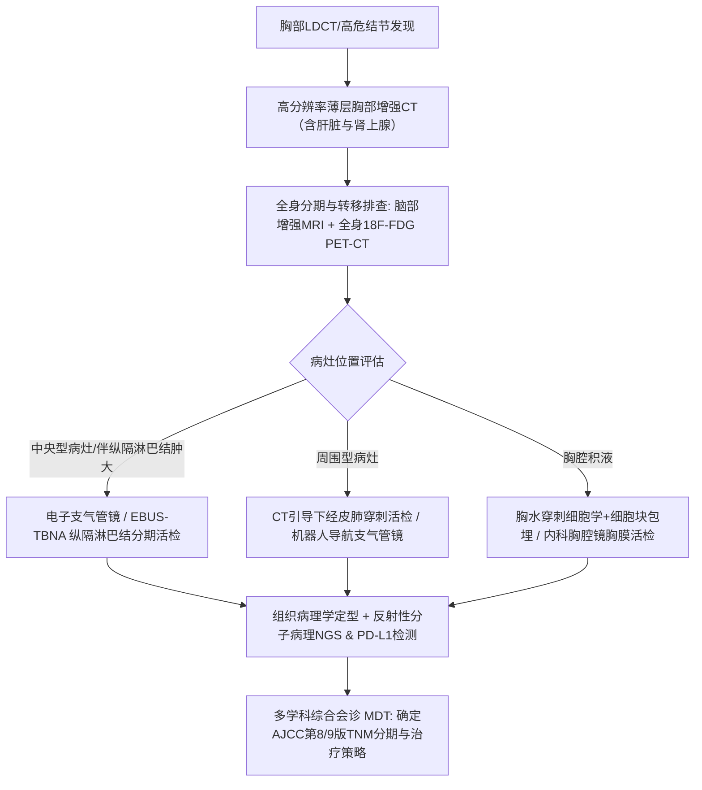
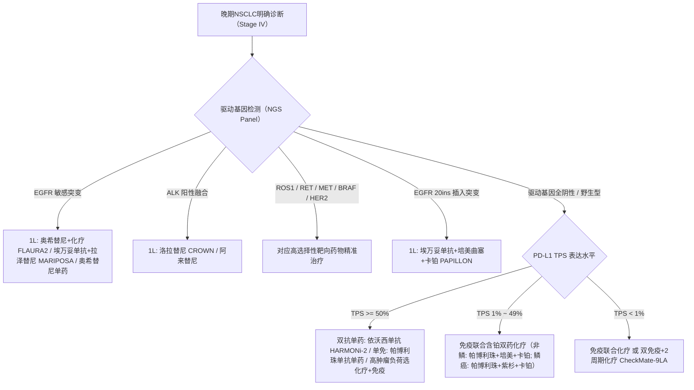

# 2026年非小细胞肺癌（NSCLC）临床诊疗与前沿临床试验实践指南
**Clinical Practice Guidelines for Non-Small Cell Lung Cancer (NSCLC): Diagnostic Workup, Standard Treatment Pathways, and Cutting-Edge Frontiers (2026 Edition)**

---

## 编委会与声明 (Editorial Board & Legal Declarations)
- **指南版本**：2026 v1.0 全面更新版
- **循证数据源**：
  - **PubMed/MEDLINE 循证支持**：依据国际前沿临床试验文献（包括 NEJM, Lancet, JCO, JAMA, Annals of Oncology 2023-2026 最新发表成果，含 FLAURA2, MARIPOSA, HARMONi-2, LAURA, ALINA, CheckMate-816, KEYNOTE-671, PAPILLON, DESTINY-Lung02 等）。
  - **ClinicalTrials.gov 临床试验数据库支持**：整合全球最新 Recruiting/Active Phase 3 关键注册研究（含 Ivonescimab, Datopotamab Deruxtecan [Dato-DXd], Sacituzumab Tirumotecan [MK-2870/SKB264], Adagrasib combos, Trastuzumab Deruxtecan 等）。
- **学术与合规声明**：
  - 本指南基于全球权威数据库（PubMed 及 ClinicalTrials.gov）检索分析编制。请用户查阅 PubMed 使用条款（https://pubmed.ncbi.nlm.nih.gov/disclaimer/ 及 https://www.ncbi.nlm.nih.gov/home/about/policies/）及 ClinicalTrials.gov 条款（https://clinicaltrials.gov/），并在获取具体文献与试验数据时遵守版权与许可规范。

---

# 第一部分：流行病学、筛查与高危人群评估

### 1.1 流行病学与组织学分型
肺癌是全球及我国发病率与死亡率均位居前列的恶性肿瘤。其中，**非小细胞肺癌（Non-Small Cell Lung Cancer, NSCLC）约占所有肺癌的 80%~85%**。
主要病理组织学亚型包括：
1. **肺腺癌 (Lung Adenocarcinoma, LUAD，约占 50%~60%)**：多发生于肺外周部，非吸烟者及女性比例较高，驱动基因突变（EGFR, ALK, ROS1, RET 等）发生率显著偏高（亚裔人群腺癌 EGFR 突变率高达 50% 左右）。
2. **肺鳞状细胞癌 (Lung Squamous Cell Carcinoma, LUSC，约占 25%~30%)**：多发生于中心支气管，与重度吸烟高度相关，常伴空洞形成，驱动基因变异以 FGFR1 扩增、PIK3CA、DDR2 为主，经典激酶突变罕见。
3. **大细胞癌 (Large Cell Carcinoma, LCC，约占 5%~10%)**：缺乏小细胞、腺癌或鳞癌明确形态分化特征。
4. **其他罕见类型**：腺鳞癌、肉瘤样癌、神经内分泌肿瘤（大细胞神经内分泌癌 LCNEC）等。

### 1.2 高危人群定义与低剂量螺旋CT（LDCT）筛查规范
根据 NLST、NELSON 试验及 NCCN/CSCO 筛查指南标准，推荐对高危个体开展年度低剂量螺旋CT（LDCT）筛查：
- **高危人群标准**：
  1. 年龄 50~80 岁（部分指南建议 45~75 岁）；
  2. 吸烟史 $\ge 20$ 包年（包年 = 每天吸烟包数 $\times$ 吸烟年数），且目前仍在吸烟或戒烟不足 15 年；
  3. 具有其他危险因素：长期被动吸烟、氡气及职业致癌物（石棉、铍、铀、氡、砷、铬、镉、二氧化硅）暴露史、一级亲属肺癌家族史、合并慢性阻塞性肺疾病（COPD）或弥漫性肺纤维化病史。
- **筛查技术与肺结节管理标准**：
  - 采用 **Lung-RADS (Lung CT Screening Reporting and Data System)** 评级系统：
    - **Category 1-2（阴性/良性，结节 < 6mm）**：继续维持 12 个月年度 LDCT 复查。
    - **Category 3（可能良性，6~8mm 实性结节或 $\ge 6mm$ 部分实性结节）**：推荐 6 个月后复查 LDCT。
    - **Category 4A（可疑恶性，8~15mm 实性结节）**：推荐 3 个月后复查 LDCT，或考虑 PET/CT 评估。
    - **Category 4B/4X（高度可疑恶性，实性结节 $\ge 15mm$ 或具有恶性征象）**：多学科（MDT）会诊，推荐胸部增强薄层 CT、PET/CT、经皮肺穿刺活检或胸腔镜直接手术切除。

---

# 第二部分：确诊流程与临床分期评估体系

### 2.1 临床诊断与分期评估路径 (Diagnostic Pathway)
疑诊肺癌患者必须接受规范、精准的全面分期评估，避免由于分期不足导致的过度治疗或治疗延误：

### 2.2 组织获取与侵入性纵隔分期原则
1. **纵隔淋巴结分期（极为关键）**：
   - 对于肿瘤 $>3	ext{ cm}$（cT2a及以上）、中央型肺癌、或 CT/PET 提示纵隔或肺门淋巴结肿大（cN1-N3）的患者，**必须进行病理学纵隔分期**。
   - **首选检查**：超声支气管镜引导下经支气管针吸活检（EBUS-TBNA）及超声内镜引导针吸活检（EUS-FNA）。
   - **补充手段**：若 EBUS/EUS 结果为阴性但 PET/CT 高度可疑 N2 转移，应考虑纵隔镜检查以排除假阴性。
2. **中枢神经系统（CNS）与骨转移排查**：
   - 增强脑 MRI 为脑部评估的金标准（敏感性显著优于增强 CT）。
   - 骨扫描或全身 PET/CT 全面排查骨及远处内脏器官转移。

### 2.3 AJCC/UICC TNM 分期系统精要 (第8版/第9版衔接)
- **T 分期（原发肿瘤）**：
  - T1: 最大径 $\le 3	ext{ cm}$（T1a $\le 1	ext{ cm}$, T1b $>1\sim 2	ext{ cm}$, T1c $>2\sim 3	ext{ cm}$）
  - T2: $>3\sim 5	ext{ cm}$ 或累及主支气管、脏层胸膜、部分肺不张
  - T3: $>5\sim 7	ext{ cm}$ 或累及胸壁、心包、同侧同叶分离卫星结节
  - T4: $>7	ext{ cm}$ 或侵犯纵隔、心脏、大血管、隆突、气管、喉返神经、食管、椎体、同侧不同叶结节
- **N 分期（区域淋巴结）**：
  - N0: 无区域淋巴结转移
  - N1: 同侧肺门、支气管旁、肺内淋巴结转移
  - N2: 同侧纵隔或隆突下淋巴结转移（第9版进一步细化 N2a 单站 与 N2b 多站）
  - N3: 对侧纵隔、对侧肺门、同侧或对侧斜角肌/锁骨上淋巴结转移
- **M 分期（远处转移）**：
  - M1a: 恶性胸膜/心包积液、对侧肺叶结节
  - M1b: 单一器官单处胸外寡转移（如单个脑转移灶、单个肾上腺转移灶）
  - M1c: 多个器官多处远处转移（M1c1 单系统多灶，M1c2 多系统多灶）

---

# 第三部分：病理学诊断与全基因谱分子检测规范

### 3.1 免疫组化（IHC）亚型鉴别
针对活检小标本，应最大限度节省组织用于后续分子检测，推荐“极简且精准”的二联或四联 IHC 标记物组：
- **腺癌标志物**：TTF-1 (+), Napsin A (+)
- **鳞癌标志物**：p40 (+), p63 (+), CK5/6 (+)
- **神经内分泌肿瘤标志物**：Synaptophysin (Syn), Chromogranin A (CgA), CD56, INSM1

### 3.2 必备反射性分子标志物（Reflex Molecular Profiling Panel）
对于所有非鳞状细胞 NSCLC，以及不吸烟/年轻/活检标本有限的鳞癌患者，在初诊时必须开展多基因靶向测序（推荐优先采用 DNA + RNA 双重二代测序 NGS 面板）：

| 基因变异类型 | 临床发生率 (亚裔/非亚裔) | 推荐检测技术 | 临床对应靶向药物方案 (1L / 后线) | 关键循证文献/里程碑试验 |
|:---|:---:|:---:|:---|:---|
| **EGFR 敏感突变** (19del, L858R) | 45%~55% (亚裔) / 15%~20% (高加索) | NGS / ddPCR / ARMS-PCR | 一线: 奥希替尼+化疗(FLAURA2)、埃万妥单抗+拉泽替尼(MARIPOSA)、奥希替尼单药、伏美替尼/阿美替尼 | FLAURA2 (NEJM 2024/2026), MARIPOSA (NEJM 2024/2025) |
| **EGFR 20外显子插入** (20ins) | 2%~3% | NGS (DNA+RNA) | 一线: 埃万妥单抗+化疗 (PAPILLON)；后线: 舒沃替尼 (Sunvozertinib)、高剂量伏美替尼 | PAPILLON (NEJM 2023), WU-KONG6 (Lancet Oncol) |
| **ALK 融合重排** (如 EML4-ALK) | 5%~7% | NGS (RNA) / IHC (Ventana D5F3) / FISH | 一线: 洛拉替尼 (Lorlatinib)、阿来替尼 (Alectinib)、布格替尼 (Brigatinib) | CROWN (JCO 2024 5年PFS 60%), ALEX, ALINA (术后辅助) |
| **ROS1 融合** | 1%~2% | NGS (RNA) / FISH / IHC初筛 | 一线/后线: 瑞波替尼 (Repotrectinib)、恩曲替尼 (Entrectinib)、克唑替尼 | TRIDENT-1 (NEJM 2023) |
| **BRAF V600E 突变** | 1%~3% | NGS / ARMS-PCR | 一线/后线: 达拉非尼+曲美替尼、康奈非尼+比美替尼 (PHAROS) | PHAROS (Lancet Oncol 2023) |
| **MET 14号外显子跳突** | 2%~3% (老年患者偏多) | NGS (RNA优于DNA) | 一线/后线: 特泊替尼 (Tepotinib)、卡马替尼 (Capmatinib)、谷美替尼、赛沃替尼 | VISION (NEJM), GEOMETRY mono-1 |
| **RET 融合** | 1%~2% | NGS (RNA) / FISH | 一线/后线: 塞普替尼 (Selpercatinib)、普拉替尼 (Pralsetinib) | LIBRETTO-431 (NEJM 2023 优于化疗+免疫) |
| **KRAS G12C 突变** | 8%~12% (吸烟者多见) | NGS / PCR | 后线及一线联合: 索托拉西布 (Sotorasib)、阿达格拉西布 (Adagrasib)、格索雷塞 | CodeBreaK 200, KRYSTAL-1 / KRYSTAL-7 |
| **HER2 (ERBB2) 突变/扩增** | 2%~4% (20外显子插入等) | NGS (DNA) | 后线/一线: 德曲妥珠单抗 (T-DXd)、宗格替尼 (Zongertinib, 创新口服TKI) | DESTINY-Lung02, Beamion LUNG-1 (NEJM 2025) |
| **NTRK 1/2/3 融合** | < 1% (泛癌种靶点) | NGS (RNA) | 拉罗替尼 (Larotrectinib)、恩曲替尼 | NAVIGATE, STARTRK-2 |
| **PD-L1 表达 (TPS)** | 约 30% TPS $\ge 50$%, 30% 1-49% | IHC (22C3 / SP263) | TPS $\ge 50$: 依沃西单抗(HARMONi-2)、帕博利珠单抗单药；TPS 1-49%: 免疫+化疗 | HARMONi-2 (Lancet 2025), KEYNOTE-024/189 |

---

# 第四部分：早期与局部晚期非小细胞肺癌系统治疗方案

### 4.1 早期可切除 NSCLC (Stage I - II, 部分可切除 IIIA)
1. **手术治疗原则**：
   - **解剖性肺叶切除术 + 系统性肺门/纵隔淋巴结清扫术**（系统清扫至少 3 组纵隔淋巴结且必须包括隆突下 7 组，至少总计清扫 6 组淋巴结）。
   - **亚肺叶切除（肺段切除术 Segmentectomy）适用指征**（基于 CALGB 140503 及 JCOG0802 试验结果）：
     - 周围型单发结节，最大径 $\le 2	ext{ cm}$；
     - 病理确认为原位腺癌（AIS）或微浸润腺癌（MIA），或磨玻璃成分为主（CTR $\le 0.5$）；
     - 切缘距离须 $\ge 2	ext{ cm}$ 或 $\ge$ 结节最大径。
2. **内科禁忌或拒绝手术患者**：
   - 推荐**立体定向体部放疗（SBRT / SABR）**：生物有效剂量（BED）$\ge 100	ext{ Gy}$（例如 $50	ext{ Gy} / 5	ext{ f}$ 或 $48	ext{ Gy} / 4	ext{ f}$）。

### 4.2 围手术期免疫综合治疗新标准 (Perioperative / Neoadjuvant IO)
对于临床分期为 IIA~IIIB 期（N0-N2）的可切除 NSCLC，**新辅助/围手术期免疫治疗已彻底重塑治疗规范**（必须术前基因检测，EGFR/ALK 突变型患者不推荐新辅助免疫）：

1. **新辅助单纯免疫联合化疗（手术前 3 周期）**：
   - **CheckMate-816 方案**：纳武利尤单抗 (Nivolumab 360mg Q3W) + 含铂双药化疗 $	imes 3$ 周期 $	o$ 手术。
   - 循证成果：病理完全缓解率 (pCR) 达到 24.0%（化疗对照组仅 2.2%），最新 2025 NEJM 随访显示出持久的 5 年总生存期 (OS) 获益。
2. **“三明治”全程围手术期免疫治疗（术前新辅助 3~4 周期 + 术后辅助免疫维持 1 年）**：
   - **KEYNOTE-671 方案**：术前帕博利珠单抗 (200mg Q3W) + 顺铂/培美曲塞或吉西他滨 $	imes 4$ 周期 $	o$ 手术 $	o$ 术后帕博利珠单抗维持 $	imes 13$ 周期（约 1 年）。显著延长 EFS 与 OS（NEJM 2023）。
   - **AEGEAN 方案**：度伐利尤单抗 (Durvalumab) 联合化疗新辅助 4 周期 $	o$ 手术 $	o$ 度伐利尤单抗维持 12 周期（NEJM 2023）。
   - **CheckMate-77T 方案**：纳武利尤单抗联合化疗新辅助 4 周期 $	o$ 手术 $	o$ 纳武利尤单抗维持 1 年。
   - **国内自主方案**：RATIONALE-315（替雷利珠单抗全程围手术期）、Neotorch（特瑞普利单抗围手术期）。

### 4.3 术后辅助靶向治疗（驱动基因阳性亚型）
对于完全切除术后（R0）且具有驱动基因敏感突变的患者，辅助靶向已取代或优于传统辅助化疗：
1. **EGFR 突变 (Ex19del / L858R, IB~IIIA 期)**：
   - **奥希替尼辅助治疗 (ADAURA 试验)**：口服奥希替尼 80mg 每日一次，治疗周期为 3 年。
   - 循证数据：5 年 DFS 率达 65%（安慰剂组 19%），降低 82% 疾病复发或死亡风险，CNS 疾病复发风险降低 88%，OS 具有统计学显著获益（HR=0.49, NEJM 2023）。
2. **ALK 融合阳性 (IB~IIIA 期)**：
   - **阿来替尼辅助治疗 (ALINA 试验)**：口服阿来替尼 600mg 每日两次，连续用药 2 年。
   - 循证数据：相比含铂化疗，2 年 DFS 率 93.8% vs 63.0%，复发或死亡风险降低 76% (HR=0.24, NEJM 2024)。

### 4.4 不可切除局部晚期 NSCLC (Unresectable Stage III) 根治性综合治疗
针对不可切除的 III 期（IIIA/IIIB/IIIC）患者，多学科团队评估不可手术后的标准治疗方案：
1. **驱动基因阴性标准策略 (PACIFIC 模式)**：
   - **同步放化疗 (cCRT)**：调强适形放疗 (IMRT) 60~66 Gy（常规分割 1.8~2.0 Gy/天）+ 同步铂类双药化疗（顺铂/依托泊苷 或 卡铂/紫杉醇）。
   - **序贯免疫巩固**：cCRT 结束后若无疾病进展，1~42 天内启动**度伐利尤单抗 (Durvalumab 10mg/kg Q2W 或 1500mg Q4W)** 维持治疗最长 12 个月。
   - 循证里程碑：5 年 OS 率达 42.9%（安慰剂组 33.4%），中位 OS 47.5 个月 vs 29.1 个月（HR=0.72）。
2. **EGFR 突变型不可切除 III 期靶向巩固新纪元 (LAURA 模式 - NEJM 2024 颠覆性研究)**：
   - **LAURA 试验方案**：针对完成放化疗（同步或序贯）且未进展的 EGFR 突变型（19del/L858R）不可手术 III 期患者，给予**奥希替尼 (80mg QD)** 巩固维持直至进展或满 3 年。
   - 循证突破：中位无进展生存期（PFS）达 **39.1 个月**，而安慰剂组仅 **5.6 个月**（HR = 0.16, 95% CI 0.10-0.24, $P < 0.001$）！彻底终结了 EGFR 突变型 III 期患者缺乏高效巩固治疗的瓶颈。

---

# 第五部分：晚期转移性（Stage IV）NSCLC 精准诊疗与规范化用药方案

### 5.1 晚期治疗一线决策逻辑树
所有晚期初治患者在治疗前必须严格遵循“**先基因，后免疫，无靶免化**”的诊治逻辑：

### 5.2 驱动基因阳性晚期一线及后线耐药治疗方案细则

#### (1) EGFR 敏感突变（Exon 19 del / L858R）
- **一线治疗三强格局**：
  1. **双抗联合靶向新方案（MARIPOSA 研究）**：
     - 药物配伍：埃万妥单抗（Amivantamab, EGFR/c-MET 双抗）+ 拉泽替尼（Lazertinib, 3代TKI）。
     - 疗效优势：中位 PFS 23.7 个月 vs 奥希替尼单药 16.6 个月（HR=0.70）；2025 最新公布显示总生存（OS）显著延长。对高危特征（TP53共突变、基线脑转移、循环肿瘤DNA ctDNA脱落）患者获益更为显著。
     - 剂型革命（PALOMA-3 研究）：皮下注射剂型可将输液相关反应发生率由静脉制剂的 63% 骤降至 13%，且缩短给药时间至数分钟。
  2. **靶向联合化疗方案（FLAURA2 研究）**：
     - 药物配伍：奥希替尼 80mg QD + 培美曲塞 500mg/m$^2$ + 卡铂 AUC 5（4周期）$	o$ 奥希替尼 + 培美曲塞长期维持。
     - 疗效优势：中位 PFS 达 25.5 个月（对照奥希替尼单药 16.7 个月，HR=0.62）；伴 CNS 脑转移患者 CNS-PFS 达 30.2 个月（HR=0.58）；2026 NEJM 确认整体 OS 趋势获益。
  3. **三代单药标准**：奥希替尼、伏美替尼、阿美替尼单药（适合高龄、体能状态 ECOG PS 2 分或拒绝联合治疗的患者）。
- **三代 TKI 耐药后精准处理对策**：
  - **再次活检或 ctDNA 基因分型**：
    - **c-MET 扩增**：奥希替尼联合赛沃替尼（Savolitinib，SAVANNAH 研究）或奥希替尼联合特泊替尼。
    - **继发 C797S 突变**：顺式突变（cis）目前正在评估第四代变构抑制剂（BLU-945, BDTX-1535）；反式突变（trans）可采用一代+三代 TKI 联合。
    - **小细胞转化（SCLC transformation）**：约占 3%~10%，按照 SCLC 给予依托泊苷+顺铂/卡铂治疗。
    - **无特定耐药基因突变**：
      - **MARIPOSA-2 方案**：埃万妥单抗 + 卡铂 + 培美曲塞（显著改善奥希替尼进展后患者的 PFS 及颅内无进展生存）。
      - **依沃西单抗联合化疗（HARMONi-A 研究 - JAMA 2024）**：依沃西单抗 (AK112, PD-1/VEGF 双抗) + 培美曲塞 + 卡铂，中位 PFS 显著延长（HR=0.46, $P < 0.001$）。
      - **HER3-DXd (Patritumab Deruxtecan)**：针对 TKI 及化疗后进展患者展现出明确客观缓解率（HERTHENA-Lung01）。

#### (2) EGFR 20号外显子插入突变 (Exon 20 insertion)
- **一线首选**：**埃万妥单抗 (Amivantamab) + 卡铂 + 培美曲塞**（PAPILLON 研究，NEJM 2023：中位 PFS 11.4 个月 vs 化疗 6.7 个月，HR=0.40）。
- **口服新药选项**：**舒沃替尼 (Sunvozertinib)**（中国已获批二线，ORR 达 60.8%，且入脑活性优异）；高剂量伏美替尼 (FAVOUR 研究)。

#### (3) ALK 阳性融合
- **一线首选方案**：
  - **洛拉替尼 (Lorlatinib, 3代 ALK-TKI)**：CROWN 研究 5 年长期随访，中位 PFS 尚未达到，5 年无进展生存率高达 **60%**（克唑替尼仅 8%，HR=0.19）；在伴基线脑转移患者中，5 年颅内进展率仅 8%（对照组 72%），是迄今为止实体瘤中靶向单药取得的最高生存控制纪录之一。
  - **阿来替尼 (Alectinib, 2代 ALK-TKI)**：中位 PFS 34.8 个月（ALEX 研究），安全性极佳，耐受性优良。
  - **布格替尼 (Brigatinib) / 恩沙替尼 (Ensartinib)**。

#### (4) ROS1 融合与 RET 融合
- **ROS1 阳性**：**瑞波替尼 (Repotrectinib)**（TRIDENT-1 试验，针对初治患者 ORR 达 79%，中位 PFS 35.7 个月；对 G2032R 耐药突变有效率达 38%）；恩曲替尼、克唑替尼。
- **RET 融合**：**塞普替尼 (Selpercatinib)**（LIBRETTO-431 研究证实一线优于化疗+帕博利珠单抗，PFS HR=0.465）；普拉替尼 (Pralsetinib)。

#### (5) KRAS G12C 突变与 HER2 突变
- **KRAS G12C 突变**：
  - **索托拉西布 (Sotorasib)** 及 **阿达格拉西布 (Adagrasib)** 获批用于二线及以上；
  - 一线前沿组合（KRYSTAL-7 / KRYSTAL-4 试验）：阿达格拉西布联合帕博利珠单抗 $\pm$ 化疗已进入关键 III 期注册研究；国产格索雷塞、氟泽雷塞相继获批二线。
- **HER2 (ERBB2) 突变**：
  - **德曲妥珠单抗 (Trastuzumab Deruxtecan, T-DXd)**：5.4 mg/kg Q3W 静脉滴注（DESTINY-Lung02 研究证实确认的 ORR 达 49.0%~53.8%，中位 DoR 16.8 个月）。
  - **宗格替尼 (Zongertinib)**：新型高选择性口服 HER2 抑制剂（Beamion LUNG-1 试验 - NEJM 2025，ORR 达 66.7%，且胃肠道及皮肤毒性极低）。

---

# 第六部分：最前沿临床疗法突破与正在招募关键试验 (Frontier Advances & Pipeline)

### 6.1 双特异性抗体（Bispecific Antibodies）全面崛起
2024~2026 年是肺癌双特异性抗体取得历史性突破的时期：

1. **依沃西单抗 (Ivonescimab, AK112 - PD-1/VEGF 双抗)**：
   - **HARMONi-2 研究 (Lancet 2025, PMID: 40057343)**：
     - 全球首个在头对头随机双盲 III 期研究中击败抗肿瘤药物标杆帕博利珠单抗（K药）的新药！
     - 入组 PD-L1 阳性（TPS $\ge 1\%$）晚期初治 NSCLC，依沃西单抗组中位 PFS 达到 **11.14 个月**，显著优于帕博利珠单抗单药的 **5.82 个月**（HR = 0.51, 95% CI 0.38-0.69, $P < 0.0001$）。
     - 无论是 PD-L1 1%~49% 还是 TPS $\ge 50$%，鳞癌还是非鳞癌，各亚组均体现出强劲的一致性获益。
   - **全球关键临床试验跟进**：
     - **HARMONi-3 (NCT05899608)**：依沃西单抗联合化疗对比帕博利珠单抗联合化疗一线治疗晚期鳞癌及非鳞癌全球多中心 III 期试验。
     - **HARMONi-7 (NCT06767514)**：针对高表达 PD-L1（TPS $\ge 50\%$）晚期初治 NSCLC，依沃西单抗对比帕博利珠单抗的全球 III 期试验。
2. **埃万妥单抗 (Amivantamab - EGFR/c-MET 双抗)**：
   - 全方位拓展至一线敏感突变（MARIPOSA）、20号外显子插入突变（PAPILLON）、奥希替尼进展后（MARIPOSA-2）以及皮下剂型改良（PALOMA-3）。
3. **新型免疫双抗**：
   - **Rilvegostomig (PD-1 / TIGIT 双抗)**：与 Dato-DXd 联合一线探索（NCT06357533）。
   - **卡度尼利单抗 (Cadonilimab - PD-1/CTLA-4 双抗)**：多项晚期 NSCLC 联合化疗研究正在推进。

### 6.2 新一代抗体偶联药物（ADCs）阵营
ADC 药物已跨越靶点界限，成为驱动基因耐药及驱动基因阴性晚期肺癌的强力后盾：

1. **TROP2 ADCs**：
   - **Datopotamab Deruxtecan (Dato-DXd)**：
     - TROPION-Lung01 随机 III 期试验：在既往经治晚期非鳞状 NSCLC 中显著改善 PFS 并展现良好耐受性。
     - 关键新招募试验：
       - **NCT06350097**：一线奥希替尼 $\pm$ Dato-DXd 治疗 EGFR 突变局部晚期/转移性 NSCLC（Phase 3）。
       - **NCT06417814**：Dato-DXd $\pm$ 奥希替尼对比含铂双药化疗用于经治 EGFR 突变 NSCLC（Phase 3）。
       - **NCT06357533**：Dato-DXd 联合 Rilvegostomig 一线治疗 PD-L1 $\ge 50\%$ 驱动基因阴性非鳞癌（Phase 3）。
   - **Sacituzumab Tirumotecan (MK-2870 / SKB264)**：
     - 采用新型拓扑异构酶 I 毒素分子及可裂解连接子，旁观者杀伤效应强。
     - 关键新招募试验：
       - **NCT06170788 (MK-2870-007)**：MK-2870 联合帕博利珠单抗对比帕博利珠单抗单药一线治疗 PD-L1 TPS $\ge 50\%$ 晚期 NSCLC（Phase 3）。
       - **NCT06312137 (MK-2870-019)**：可手术未达 pCR 的 NSCLC 患者术后接受帕博利珠单抗 $\pm$ MK-2870 辅助治疗（Phase 3）。
       - **NCT06422143 (MK-2870-023)**：转移性鳞癌维持治疗（Phase 3）。
2. **HER3 ADC 与 c-MET ADC**：
   - **Patritumab Deruxtecan (HER3-DXd)**：克服 EGFR-TKI 多重旁路耐药机制。
   - **Telisotuzumab Vedotin (Teliso-V)**：LUMINOSITY 试验验证 c-MET 过表达非鳞癌疗效，已获 FDA 优先审评。
3. **双抗 ADC (Bispecific ADC)**：
   - **BL-B01D1 (EGFR $	imes$ HER3 双抗 ADC)**：中国原创自主研发，兼具靶向 EGFR 与 HER3 双重受体介导内吞优势，在多线耐药 NSCLC 中展示出超过 40% 的高客观缓解率。

### 6.3 细胞免疫疗法、个体化 mRNA 肿瘤疫苗与耐药靶向
1. **清除耐药持久性细胞（Drug-Tolerant Persister, DTP）**：
   - 2025 年 Cancer Discovery 研究指出（PMID: 40762432），靶向 TROP2 的 CAR-T 细胞疗法能够特异性清除 EGFR-TKI 治疗后残留的微小持久性细胞，有望大幅推迟甚至根除复发。
2. **mRNA 新抗原个性化肿瘤疫苗**：
   - mRNA-4157 (V940) 联合抗 PD-1 单抗术后辅助治疗，已在黑色素瘤及非小细胞肺癌早期患者中展开国际多中心关键试验。
3. **全 RAS (Pan-KRAS) 及 RAS-ON 抑制剂**：
   - RMC-6236（直接靶向激活状态下的 RAS(ON) 三聚体复合物），对 KRAS G12D、G12V、G12R 等突变均具备广谱强效抑制力。

---

# 第七部分：多学科综合诊疗（MDT）全流程实施与毒性管理核查清单

### 7.1 MDT 协作核心机制
肺癌诊疗高度依赖胸外科、肿瘤内科、呼吸科、放疗科、病理科、介入放射科及核医学科紧密协作：
1. **初诊必查清单**：
   - [ ] 薄层胸部增强 CT（含全肝、双侧肾上腺）
   - [ ] 增强脑 MRI（排查隐匿脑微小转移）
   - [ ] 全身 18F-FDG PET/CT（排除远处寡转移）
   - [ ] 活检组织病理分型确认（至少完成 TTF-1 与 p40 鉴别）
   - [ ] 大 Panel NGS 基因测序（DNA+RNA，覆盖 10 大关键驱动基因）
   - [ ] PD-L1 免疫组化表达检测（记录明确的 TPS 数值）
2. **早期及局晚手术前评估**：
   - [ ] 肺功能评估（FEV1, DLCO，评估肺叶切除耐受度）
   - [ ] 心脏负荷评估（心电图、心脏彩超）
   - [ ] 若病灶 $>3	ext{ cm}$ 或伴可疑淋巴结：必须行 EBUS-TBNA 纵隔病理分期
3. **治疗全程不良反应监测规范**：
   - **免疫相关不良事件 (irAEs)**：
     - 重点警惕免疫性肺炎（CIP）：任何出现咳嗽加重、活动后气促、发热的患者，须立即行胸部薄层平扫 CT 并停用免疫。$\ge 2$ 级立即启动泼尼松 $1\sim 2	ext{ mg/kg/d}$ 冲击治疗。
     - 免疫性心肌炎：监测心肌酶谱、肌钙蛋白（Troponin-T/I）及心电图。
     - 免疫性内分泌毒性：常规检测促甲状腺激素（TSH）、游离T3/T4、促肾上腺皮质激素（ACTH）及皮质醇。
   - **靶向治疗毒性**：
     - EGFR-TKI：腹泻、皮疹/甲沟炎、间质性肺病（ILD）监测。
     - 埃万妥单抗：输液相关反应（首剂预先给予地塞米松+抗组胺药+对乙酰氨基酚，推荐首选皮下剂型）。
     - ALK-TKI（洛拉替尼）：高胆固醇血症、高甘油三酯血症及中枢神经认知/精神症状监测。
   - **ADC 药物毒性**：
     - 间质性肺病/肺炎（ILD/Pneumonitis）：T-DXd 及 Dato-DXd 需高度警惕，一旦怀疑任何级别药物性 ILD，立即暂停给药并尽早使用糖皮质激素。
     - 骨髓抑制、恶心呕吐及脱发。

---

# 第八部分：核心循证文献索引与试验登记号 (Evidence & Trial Directory)

### 8.1 关键 PubMed 检索文献（点击访问原文献）
1. **NCCN NSCLC Guidelines (2024/2026 Edition)**: [PMID: 38754467](https://pubmed.ncbi.nlm.nih.gov/38754467/) | [PMID: 41956107](https://pubmed.ncbi.nlm.nih.gov/41956107/)
2. **HARMONi-2 Trial (Ivonescimab vs Pembrolizumab in PD-L1+ NSCLC)**: [Lancet 2025; PMID: 40057343](https://pubmed.ncbi.nlm.nih.gov/40057343/)
3. **FLAURA2 Trial (Osimertinib plus Chemotherapy in 1L EGFR-mutated NSCLC)**: [NEJM 2023/2026; PMID: 41104938](https://pubmed.ncbi.nlm.nih.gov/41104938/)
4. **MARIPOSA Trial (Amivantamab + Lazertinib in 1L EGFR-mutated NSCLC)**: [NEJM 2024/2025; PMID: 38924756](https://pubmed.ncbi.nlm.nih.gov/38924756/) | [PMID: 40923797](https://pubmed.ncbi.nlm.nih.gov/40923797/)
5. **MARIPOSA-2 Trial (Amivantamab combos after Osimertinib progression)**: [Ann Oncol 2024; PMID: 37879444](https://pubmed.ncbi.nlm.nih.gov/37879444/)
6. **HARMONi-A Trial (Ivonescimab + Chemo in EGFR-TKI progressed NSCLC)**: [JAMA 2024; PMID: 38820549](https://pubmed.ncbi.nlm.nih.gov/38820549/)
7. **LAURA Trial (Osimertinib after Chemoradiotherapy in Stage III EGFRm NSCLC)**: [NEJM 2024; PMID: 38828946](https://pubmed.ncbi.nlm.nih.gov/38828946/)
8. **CheckMate-816 Trial (Neoadjuvant Nivolumab + Chemo long-term OS)**: [NEJM 2022/2025; PMID: 40454642](https://pubmed.ncbi.nlm.nih.gov/40454642/)
9. **KEYNOTE-671 Trial (Perioperative Pembrolizumab in early-stage NSCLC)**: [NEJM 2023; PMID: 37272513](https://pubmed.ncbi.nlm.nih.gov/37272513/)
10. **AEGEAN Trial (Perioperative Durvalumab in resectable NSCLC)**: [NEJM 2023; PMID: 37870974](https://pubmed.ncbi.nlm.nih.gov/37870974/)
11. **ALINA Trial (Adjuvant Alectinib in ALK-positive resected NSCLC)**: [NEJM 2024; PMID: 38598794](https://pubmed.ncbi.nlm.nih.gov/38598794/)
12. **ADAURA Trial (Adjuvant Osimertinib in EGFR-mutated resected NSCLC)**: [NEJM 2020/2023; PMID: 32955177](https://pubmed.ncbi.nlm.nih.gov/32955177/) | [PMID: 36720083](https://pubmed.ncbi.nlm.nih.gov/36720083/)
13. **PAPILLON Trial (Amivantamab + Chemo in EGFR Exon 20 insertion)**: [NEJM 2023; PMID: 37870976](https://pubmed.ncbi.nlm.nih.gov/37870976/)
14. **Zongertinib in HER2-mutated NSCLC (Beamion LUNG-1)**: [NEJM 2025; PMID: 40293180](https://pubmed.ncbi.nlm.nih.gov/40293180/)
15. **PALOMA-3 Trial (Subcutaneous vs Intravenous Amivantamab)**: [JCO 2024; PMID: 38857463](https://pubmed.ncbi.nlm.nih.gov/38857463/)
16. **CAR-T Targeting TROP2 in EGFR-mutated Persister Cells**: [Cancer Discovery 2025; PMID: 40762432](https://pubmed.ncbi.nlm.nih.gov/40762432/)

### 8.2 正在招募中的国际前沿关键 Phase 3 临床试验（ClinicalTrials.gov）
1. **NCT05899608 (HARMONi-3)**: Ivonescimab (AK112, PD-1/VEGF 双抗) 联合化疗对比帕博利珠单抗联合化疗一线治疗晚期转移性 NSCLC 全球 III 期研究。
2. **NCT06767514 (HARMONi-7)**: 依沃西单抗单药对比帕博利珠单抗单药一线治疗 PD-L1 高表达（TPS $\ge 50\%$）转移性 NSCLC 全球 III 期研究。
3. **NCT06350097 (TROPION-Lung14)**: 奥希替尼联合或不联合 Datopotamab Deruxtecan (Dato-DXd) 一线治疗 EGFR 突变局部晚期/转移性 NSCLC 的 Phase 3 研究。
4. **NCT06417814**: Dato-DXd 联合或不联合奥希替尼对比含铂双药化疗用于既往接受过治疗的 EGFR 突变 NSCLC。
5. **NCT06357533**: Dato-DXd 联合 Rilvegostomig (PD-1/TIGIT 双抗) 对比帕博利珠单抗一线治疗 PD-L1 高表达（$\ge 50\%$）且无驱动基因变异的晚期非鳞状 NSCLC（Phase 3）。
6. **NCT06170788 (MK-2870-007)**: Sacituzumab Tirumotecan (MK-2870/SKB264, TROP2 ADC) 联合帕博利珠单抗对比帕博利珠单抗单药一线治疗 PD-L1 TPS $\ge 50\%$ 晚期 NSCLC（Phase 3）。
7. **NCT06312137 (MK-2870-019)**: 可切除 NSCLC 新辅助免疫化疗后未达病理完全缓解 (non-pCR) 患者接受帕博利珠单抗 $\pm$ MK-2870 辅助强化治疗（Phase 3）。
8. **NCT06422143 (MK-2870-023)**: 晚期鳞状 NSCLC 转移性一线后 Sacituzumab Tirumotecan 维持治疗对比观察（Phase 3）。
9. **NCT06875310 (KRYSTAL-4)**: 阿达格拉西布 (Adagrasib) 联合帕博利珠单抗和含铂双药化疗一线治疗初治伴 KRAS G12C 突变非鳞状 NSCLC（Phase 3）。
10. **NCT06899126**: 德曲妥珠单抗 (T-DXd) 联合帕博利珠单抗和含铂双药化疗一线治疗 HER2 过表达晚期 NSCLC（Phase 3）。
